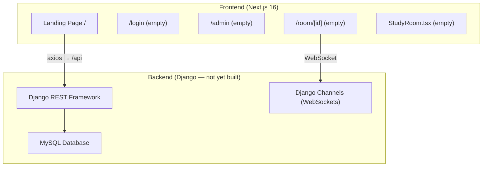

# Virtual Study Group — Project Walkthrough

## Overview

An **AI-powered collaborative learning platform** where students can join live video study rooms, get guidance from an AI teacher, and receive session summaries. The project is a **full-stack application** with a Next.js frontend and a Django backend (backend not yet implemented).

---

## Architecture



## Tech Stack

| Layer | Technology | Status |
|-------|-----------|--------|
| Frontend Framework | **Next.js 16** (App Router) | ✅ Set up |
| UI Components | **shadcn/ui** + Radix UI (57 components) | ✅ Installed |
| Styling | **Tailwind CSS v4** + `tw-animate-css` | ✅ Configured |
| Icons | **Lucide React** | ✅ In use |
| API Client | **Axios** → `localhost:8000/api` | ✅ Configured |
| Backend Framework | **Django ≥ 4.2** + DRF | ❌ Not built |
| Real-time | **Django Channels** (WebSockets) | ❌ Not built |
| Database | **MySQL** (mysqlclient) | ❌ Not built |

---

## Project Structure

```
Virtual_Study_Group/
├── .env.local                    # API URL config
├── backend/
│   └── requirements.txt          # Django, DRF, Channels, mysqlclient, python-dotenv
└── frontend/
    ├── app/
    │   ├── layout.tsx            # Root layout (Geist font, Vercel Analytics)
    │   ├── page.tsx              # Landing page (assembles all sections)
    │   ├── globals.css           # Tailwind v4 theme tokens (light + dark mode)
    │   ├── StudyRoom.tsx         # 🔴 Empty stub
    │   ├── login/page.tsx        # 🔴 Empty stub
    │   ├── admin/page.tsx        # 🔴 Empty stub
    │   └── room/[id]/page.tsx    # 🔴 Empty stub
    ├── components/
    │   ├── navbar.tsx            # Sticky navbar with mobile menu
    │   ├── hero-section.tsx      # Hero with stats + preview image
    │   ├── features-section.tsx  # 6 feature cards
    │   ├── how-it-works-section.tsx  # 5-step flow
    │   ├── ai-demo-section.tsx   # Simulated AI chat conversation
    │   ├── study-room-section.tsx # Study room preview (video grid + chat)
    │   ├── admin-dashboard-section.tsx # Admin stats + feature cards
    │   ├── tech-stack-section.tsx # Tech badges
    │   ├── cta-section.tsx       # Call-to-action (Student / Educator)
    │   ├── footer.tsx            # Links + branding
    │   ├── theme-provider.tsx    # next-themes wrapper
    │   └── ui/                   # 57 shadcn/ui components
    ├── hooks/
    │   ├── use-mobile.ts         # Mobile breakpoint hook
    │   └── use-toast.ts          # Toast notification hook
    ├── lib/
    │   ├── api.ts                # Axios instance → NEXT_PUBLIC_API_URL
    │   └── utils.ts              # cn() utility (clsx + tailwind-merge)
    └── package.json              # Dependencies
```

---

## Application Flow

### 1. Landing Page (`/`) — **Fully built**

The home page is a marketing/showcase page composed of 10 sections rendered in order:

1. **Navbar** — Sticky header with logo, nav links (Features, How It Works, AI Demo, Admin), Log in / Sign up buttons, and mobile hamburger menu
2. **Hero** — Headline "Study Together, Anywhere", CTA buttons (Join / Create room), stats (10K+ students, 500+ rooms, 98% satisfaction), preview image with floating badges
3. **Features** — 6 cards: Live Video, AI Teacher, Admin Rules, AI Summaries, Study Planner, Collaborative Learning
4. **How It Works** — 5 steps: Sign Up → Create/Join Room → Start Session → Ask AI → Get Summary
5. **AI Demo** — Simulated chat showing admin-controlled AI guiding a student through a quadratic equation step-by-step
6. **Study Room Preview** — Mock UI with 4-person video grid, media controls (mic/video/screen share/end call), and side chat panel
7. **Admin Dashboard** — Stats cards + admin feature cards (AI settings, Analytics, Rooms, Students)
8. **Tech Stack** — Badges for Django, REST APIs, AI Models, WebSockets, WebRTC, PostgreSQL
9. **CTA** — "Start Learning Smarter Today" with Student/Educator buttons
10. **Footer** — Product/Resources/Company links

### 2. Login Page (`/login`) — 🔴 Empty

No implementation yet. Placeholder file exists.

### 3. Admin Dashboard (`/admin`) — 🔴 Empty

No implementation yet. Placeholder file exists.

### 4. Study Room (`/room/[id]`) — 🔴 Empty

Dynamic route for individual study rooms. No implementation yet.

### 5. Backend — 🔴 Not started

Only [requirements.txt](file:///c:/Users/Mallesh/Projects/Virtual_Study_Group/backend/requirements.txt) exists with dependencies listed. No Django project, settings, models, views, or URL configs have been created.

---

## Key Observations

> [!IMPORTANT]
> The project is currently a **frontend-only landing page**. All functional pages (login, admin, study room) and the entire backend are empty stubs.

- **What's complete**: A polished landing/marketing page with all sections fully designed using shadcn/ui components
- **What's missing**:
  - Authentication system (login/signup)
  - Actual study room with video (WebRTC) and real-time chat (WebSockets)
  - Admin dashboard with real functionality
  - Entire Django backend (models, APIs, WebSocket consumers)
  - Database setup (MySQL)
  - AI teacher integration
- The [ThemeProvider](file:///c:/Users/Mallesh/Projects/Virtual_Study_Group/frontend/components/theme-provider.tsx#9-12) component exists but is **not used** in [layout.tsx](file:///c:/Users/Mallesh/Projects/Virtual_Study_Group/frontend/app/layout.tsx) (no dark mode toggle wired up)
- The [api.ts](file:///c:/Users/Mallesh/Projects/Virtual_Study_Group/frontend/lib/api.ts) axios client is configured but **not used** anywhere yet
- [next.config.mjs](file:///c:/Users/Mallesh/Projects/Virtual_Study_Group/frontend/next.config.mjs) has `ignoreBuildErrors: true` and `unoptimized` images
